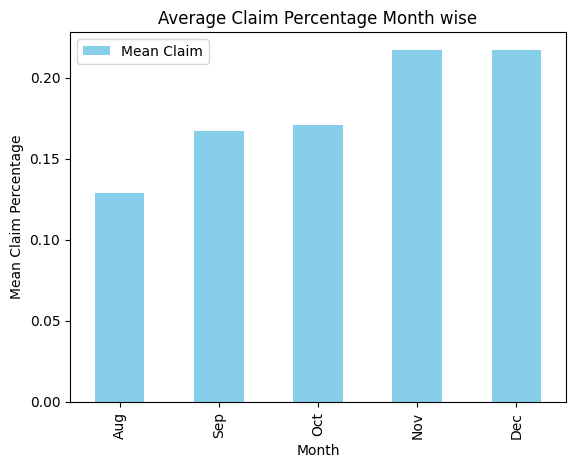
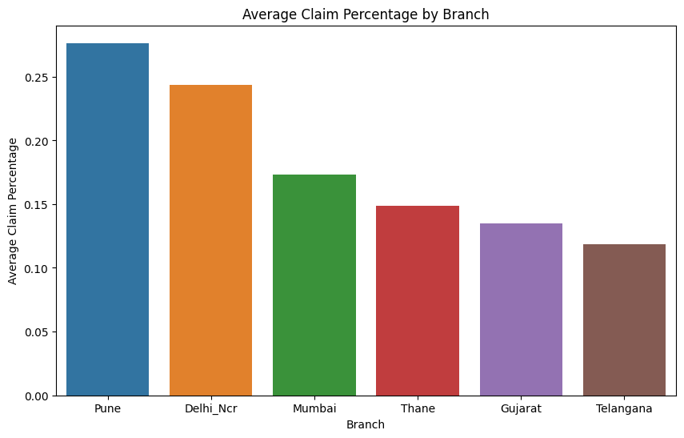
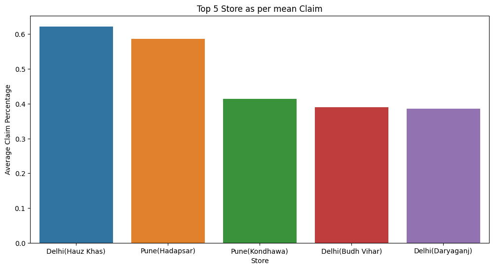
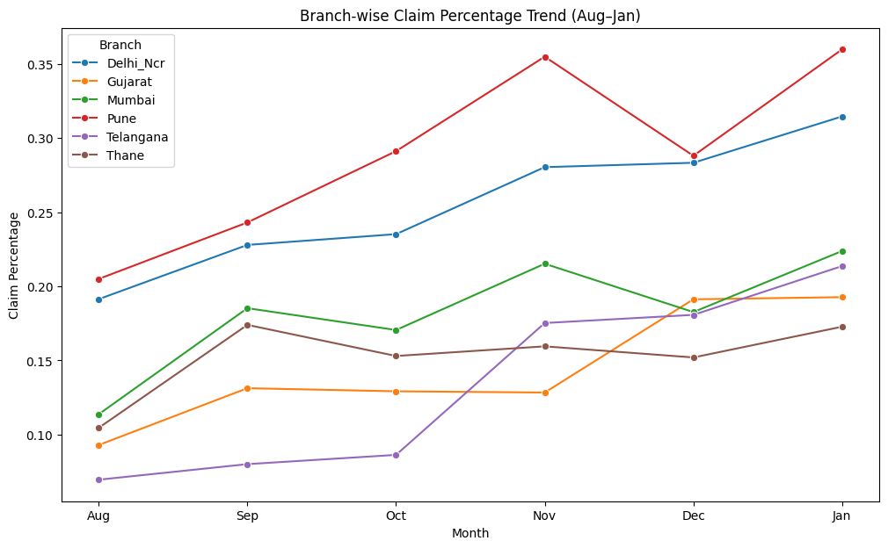

# Jumbo & Company: Claim Attachment Analysis Report

## 1. Executive Summary
This report analyzes the "Attach %" (Claim Percentage) data for Jumbo & Company across **163 stores** and **6 major branches** over a five-month period (August to December).

**Key Findings:**
* **Overall Trend:** There is a consistent, significant upward trend in claim attachment percentages from August (12.8% avg) to December (21.7% avg).
* **Top Performers:** The **Pune** and **Delhi_NCR** branches consistently outperform other regions.
* **Areas for Improvement:** The **Gujarat** and **Telangana** branches show the lowest average attachment rates.
* **Forecast:** Based on linear trend analysis, the upward trajectory is expected to continue into January, particularly for the high-performing branches.

---

## 2. Data Overview
* **Total Records:** 163 Stores.
* **Time Period:** August to December (5 months).
* **Metrics:** Monthly Attach % and a calculated "Five-month Mean."
* **Branch Distribution:**
    * Delhi_NCR: 44 Stores
    * Telangana: 40 Stores
    * Gujarat: 24 Stores
    * Thane: 20 Stores
    * Mumbai: 19 Stores
    * Pune: 16 Stores

---

## 3. Performance Analysis

### A. Monthly Trend Analysis
The aggregate data shows a robust month-over-month growth in attachment percentages. The chart below visualizes this steady climb from August to December.

| Month | Average Claim % | Trend |
| :--- | :--- | :--- |
| **August** | ~12.8% | Baseline |
| **September** | ~16.7% | ⬆ Increase |
| **October** | ~17.1% | ➡ Steady |
| **November** | ~21.7% | ⬆ Sharp Increase |
| **December** | ~21.7% | ➡ Sustained High |

**Insight:** The most significant growth period occurred between October and November. The spread (variance) of the data also increased in November and December, indicating that while high-performing stores are doing much better, low-performing stores are lagging further behind.

### B. Branch-wise Performance
When broken down by region, clear leaders emerge. **Pune** and **Delhi_NCR** are the top performers, while **Gujarat** and **Telangana** lag behind. This disparity is clearly visible in the bar chart below.

* **Leaders:**
    * **Pune:** Recorded the highest average claim percentage (approx. 29% average over 5 months).
    * **Delhi_NCR:** Second highest performance (approx. 21% average).
* **Laggards:**
    * **Gujarat & Telangana:** These branches recorded the lowest averages (below 17%).

### C. Store-Specific Insights
The report isolated the top 5 performing stores based on their five-month mean. The **Up(Greater Noida)** and **Pune(Bhosari)** stores are currently setting the benchmark for the rest of the company.

* *Notable examples from the data preview include:*
    * **Up(Greater Noida) Br (Delhi_NCR):** High consistent performance (Avging 35%).
    * **Pune(Bhosari) Br:** Strong performance (Avging 29.4%).

---

## 4. Predictive Analysis (January Forecast)

A linear regression model (polyfit degree 1) was applied to the historical data of every store to predict the outcome for **January**.

The line chart below illustrates the actual performance (solid lines) and the forecasted trajectory (markers) for each branch. Note the steep upward slopes for Pune and Delhi_NCR compared to the flatter trajectory of Gujarat.

### Forecasted Trends by Branch:
1.  **Delhi_NCR:** Projected to cross the **30%** mark in January.
2.  **Pune:** Projected to reach approximately **36%**, maintaining its lead.
3.  **Mumbai:** Shows a positive trend, expected to reach ~22%.
4.  **Gujarat & Telangana:** Expected to remain relatively flat or show marginal growth (19-21%).

---

## 5. Recommendations

1.  **Knowledge Transfer:** Conduct a study of the **Pune** and **Delhi_NCR** branches to understand specific sales behaviors or operational practices driving their high attachment rates. Implement these best practices in **Gujarat** and **Telangana**.
2.  **Variance Management:** The increasing spread in data suggests a lack of consistency. Standard operating procedures (SOPs) regarding claims/attachments should be reinforced to ensure low-performing stores meet the median baseline.
3.  **January Resource Planning:** With predictions showing an all-time high for January (especially in Pune), ensure inventory and staffing are prepared to handle increased volume.
4.  **Targeted Training:** Focus immediate remedial training on the bottom 10% of stores, specifically within the Gujarat region, as their trend line is the flattest.
